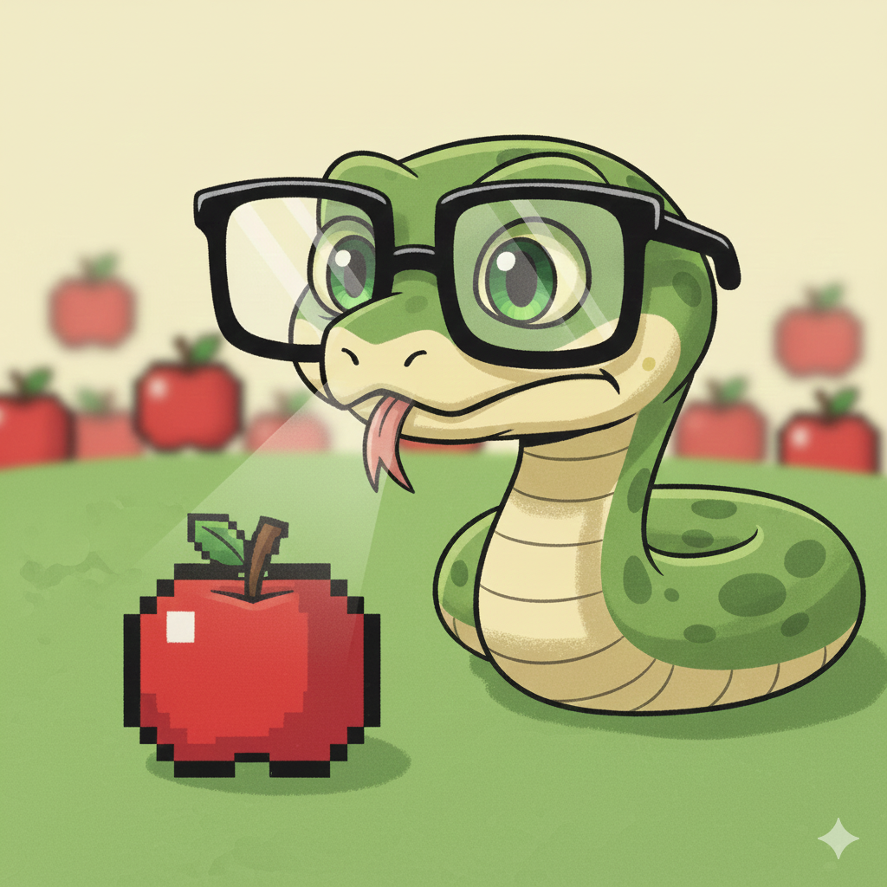

# 🐍 TheSquintingSerpent (Deep Reinforcement Learning)

<p align="center">
  
</p>

A fully featured **Snake game with a Deep Q-Learning (DQN) agent**, supporting:

- 🧠 Reinforcement Learning (PyTorch)
- 👃 Food “smell” (relative food position)
- 🍴 Hunger mechanism (reward shaping)
- 🧱 Custom maps (from `.txt` files)
- 🪟 Wrap / no-wrap borders
- 🎮 Human play
- 📺 Pygame GUI (centered grid, large window)
- 💾 Save / load / resume training
- 🏆 Best model & last model saving

---

## 📁 Project Structure
```
.
├── snake_game.py # Game environment + pygame renderer
├── dqn_agent.py # DQN model, replay buffer, checkpoints
├── train.py # Training loop (with resume support)
├── play.py # Play as human or watch trained AI
├── maps/
│ └── map_*.txt # Custom maps (0 = free, 1 = wall)
├── models/
│ ├── best.pt # Best model by score
│ ├── last.pt # Last episode model
│ └── checkpoint.pt # Full checkpoint (resume training)
└── README.md
```

---

## ⚙️ Requirements

```bash
pip install pygame torch numpy
```

Python 3.9+ recommended.

---

## 🧱 Maps

Maps are simple text files:
- 0 → free cell
- 1 → wall

Rectangular grid

Size of the map defines the game size

--- 

## 🧠 AI Observation Space

Each step the AI receives:

1. Local vision grid (3, 2N+1, 2N+1)
- Channel 0: walls
- Channel 1: snake body
- Channel 2: food
2. Hunger ∈ [0, 1]
3. Smell vector (dx, dy)
- Relative distance from head → food
- Normalized
- Wrap-aware (shortest distance)
```python
Observation = (grid, hunger, smell)
```

---

## 🎯 Actions
```ini
0 = UP
1 = DOWN
2 = LEFT
3 = RIGHT
```

⚠️ Reverse direction is blocked (classic Snake behavior).
The snake can never move into its neck, even during training.

---

## ☠️ Game Over Rules

The game ends if the snake:
- ❌ Hits a wall
- ❌ Hits its own body
Hunger does not kill directly — it only adds increasing negative reward.

---

## 🏅 Rewards

- +1.0 → eat food
- −1.0 → die (wall or self)
- −0.01 → per step
- extra penalty proportional to hunger

This encourages:
- faster food seeking
- less wandering
- stable learning

---

## 🧪 Training the AI

Basic training (with GUI)
```bash
python train.py \
  --map maps/map_10x10.txt \
  --N 2 \
  --render \
  --wrap \
  --games 5000
```

No wrap (classic borders)
```bash
python train.py \
  --map maps/map_10x10.txt \
  --N 2 \
  --render \
  --no-wrap \
  --games 5000
```

---

## ▶️ Resume Training (IMPORTANT)

Training automatically saves a full checkpoint.
To continue training from where you stopped:

```bash
python train.py \
  --map maps/map_10x10.txt \
  --N 2 \
  --render \
  --wrap \
  --games 2000 \
  --resume <path-to-model>
```

This restores:
- model weights
- target network
- optimizer state
- episode counter
- best score

---

## 💾 Saved Models

| File                   | Meaning             |
| ---------------------- | ------------------- |
| `models/best.pt`       | Best score achieved |
| `models/last.pt`       | Last episode        |
| `models/checkpoint.pt` | Resume training     |

---

## 🎮 Play the Game

Watch AI play
```bash
python play.py \
  --map maps/map_10x10.txt \
  --N 2 \
  --wrap \
  --model models/best.pt
```

Play as human
```bash
python play.py \
  --map maps/map_10x10.txt \
  --human \
  --wrap
```

Controls:
- ⬆️ Up
- ⬇️ Down
- ⬅️ Left
- ➡️ Right

---

📺 GUI Features

- Large window
- Game grid centered
- HUD outside the grid
- Live training info:
  - episode
  - score
  - best score
  - epsilon
  - loss
  - checkpoint path

---

## 🧠 Design Decisions (Why it works well)
✔ No reverse action → cleaner action space
✔ Relative observations → translation invariant
✔ Smell vector → faster convergence
✔ Hunger shaping → prevents infinite loops
✔ Resume training → practical for long runs

---

## Advantages of NxN Sight + Smell in Snake AI

- **Generalization**: The agent learns local patterns, not fixed map layouts.
- **Scalability**: Works on any map size without changing the network.
- **Faster Learning**: Smaller state space → more stable and efficient training.
- **Robustness**: Partial observability prevents brittle, map-specific strategies.
- **Goal Awareness**: Smell (dx, dy) gives direction without solving the path.
- **Natural Behavior**: Produces snake-like movement instead of optimal but unnatural paths.
- **Transferability**: Same policy works on unseen maps and different environments.
- **Realistic Design**: Mirrors real agents (local sensors + goal direction).
- **Reduced Overfitting**: No absolute positions or full-map shortcuts.
- **Clean Action Space**: Encourages anticipation rather than memorization.


---

## 🚀 Possible Extensions
- Add body-relative offsets (top-K segments)
- Add danger flags (up/down/left/right)
- LSTM for memory
- Curriculum maps (easy → hard)
- Map editor in pygame
- Imitation learning from human play

